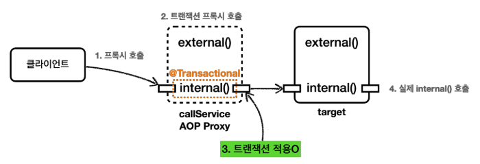
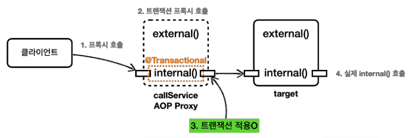
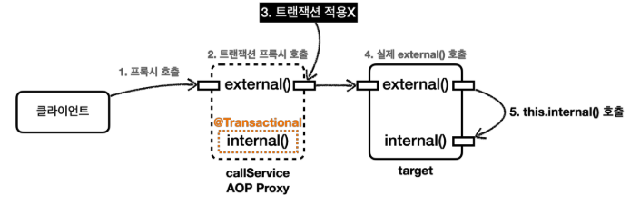

# 트랜잭션 AOP 주의 사항 - 프록시 내부 호출 1

```@Transactional``` 을 사용하면 스프링의 트랜잭션 AOP가 적용된다.<br>
트랜잭션 AOP는 기본적으로 프록시 방식의 AOP를 사용한다.
프록시 객체가 요청을 먼저 받아서 트랜잭션을 처리하고, 실제 객체를 호출해준다.<br>
따라서 트랜잭션을 적용하려면 항상 프록시를 통해서 대상 객체(Target)을 호출해야 한다.
이렇게 해야 프록시에서 먼저 트랜잭션을 적용하고, 이후에 대상 객체를 호출하게 된다.
만약 프록시를 거치지 않고 대상 객체를 직접 호출하게 되면 AOP가 적용되지 않고, 트랜잭션도 적용되지 않는다.



AOP를 적용하면 스프링은 대상 객체 대신에 프록시를 스프링 빈으로 등록한다.
따라서 스프링은 의존관계 주입시에 항상 실제 객체 대신에 프록시 객체를 주입한다.
프록시 객체가 주입되기 때문에 대상 객체를 직접 호출하는 문제는 일반적으로 발생하지 않는다.
하지만 **대상 객체의 내부에서 메서드 호출이 발생하면 프록시를 거치지 않고 대상 객체를 직접 호출하는 문제가 발생**한다.
이렇게 되면 ```@Transactional```이 있어도 트랜잭션이 적용되지 않는다.<br>
실무에서 반드시 한번은 만나서 고생하는 문제이기 때문에 꼭 이해하고 넘어가자.

예제(InternalCallV1Test.java)를 통해서 내부 호출이 발생할 때 어떤 문제가 발생하는지 알아보자.

<br>

### CallService
* ```external()``` 은 트랜잭션이 없다.
* ```internal()``` 은 ```@Transactional```을 통해 트랜잭션을 적용한다.

```@Transactional``` 이 하나라도 있으면 트랜잭션 프록시 객체가 만들어진다. 그리고 ```callService```빈을 주입 받으면 트랜잭션 프록시 객체가 대신 주입된다.

<br>

다음 코드를 실행해보자.
```java
@Test
void printProxy(){
    log.info("callService class={}",callService.getClass());
}
```
여기서는 테스트에서 ```callService```를 주입 받는데, 해당 클래스를 출력해보면 뒤에 CGLIB...이 붙은 것을 확인할 수 있다.
원본 객체 대신에 트랜잭션을 처리하는 프록시 객체를 주입 받은 것이다.
```
callService class=class hello..InternalCallV1Test$CallService$$EnhancerBySpringCGLIB$$4ec3f332
```

<br>

### internalCall() 실행
```internalCall()```은 트랜잭션이 있는 코드인 ```internal()```을 호출한다.

<br>

### internal()
```java
@Transactional
public void internal(){
    log.info("call internal");
    printTxInfo();
}
```


1. 클라이언트인 테스트 코드는 ```callService.internal()``` 을 호출한다. 여기서 ```callService```는 트랜잭션 프록시이다.
2. ```callService```의 트랜잭션 프록시가 호출된다.
3. ```internal()``` 메서드에 ```@Transactional```이 붙어 있으므로 트랜잭션 프록시는 트랜잭션을 적용한다.
4. 트랜잭션 적용 후 실제 ```callService```객체 인스턴스의 ```internal()```을 호출한다.
5. 실제 ```callService```가 처리를 완료하면 응답이 트랜잭션 프록시로 돌아오고, 트랜잭션 프록시는 트랜잭션을 완료한다.

<br>

### 실행 로그 - internalCall()
```
TransactionInterceptor       : Getting transaction for
[..CallService.internal]
..rnalCallV1Test$CallService : call internal
..rnalCallV1Test$CallService : tx active=true
TransactionInterceptor       : Completing transaction for
[..CallService.internal]
```
* ```TransactionInterceptor```가 남긴 로그를 통해 트랜잭션 프록시가 트랜잭션을 적용한 것을 확인할 수 있다.
* ```CallService```가 남긴 ```tx active=true```로그를 통해 트랜잭션이 적용되어 있음을 확인할 수 있다.

지금까지 본 내용은 이해하기 어렵지 않을 것이다. 이제 본격적으로 문제가 되는 부분을 확인해보자.

<br>

### externalCall() 실행
```externalCall()``` 은 트랜잭션이 없는 코드인 ```external()``` 을 호출한다.

<br>

### external()
```java
public void external() {
    log.info("call external");
    printTxInfo();
    internal();
}

@Transactional
public void internal() {
    log.info("call internal");
    printTxInfo();
}
```
```external()``` 은 ```@Transactional``` 애노테이션이 없다. 따라서 트랜잭션 없이 시작한다.
그런데 내부에서 ```@Transactional``` 이 있는 ```internal()``` 을 호출하는 것을 확인할 수 있다.<br>
이 경우 ```external()``` 은 트랜잭션이 없지만, ```internal()``` 에서는 트랜잭션이 적용되는 것 처럼 보인다.

<br>

### 실행 로그 - externalCall()
```
CallService : call external
CallService : tx active=false
CallService : call internal
CallService : tx active=false
```
실행 로그를 보면 트랜잭션 관련 코드가 전혀 보이지 않는다. 프록시가 아닌 실제 callService 에서 남긴 로그만 확인된다.
추가로 ```internal()``` 내부에서 호출한 ```tx active=false``` 로그를 통해 확실히 트랜잭션이 수행되지 않은 것을 확인할 수 있다.<br>
기대와 다르게 ```internal()```에서 트랜잭션이 전혀 적용되지 않았다. 왜 이런 문제가 발생하는 것일까?

<br>

## 프록시와 내부 호출


실제 호출되는 흐름을 천천히 분석해보자.
1. 클라이언트인 테스트 코드는 ```callService.external()```을 호출한다. 여기서 ```callService```는 트랜잭션 프록시이다.
2. ```callService```의 트랜잭션 프록시가 호출된다.
3. ```external()``` 메서드에는 ```@Transactional``` 이 없다. 따라서 트랜잭션 프록시는 트랜잭션을 적용하지 않는다.
4. 트랜잭션 적용하지 않고, 실제 ```callService```객체 인스턴스의 ```external()```을 호출한다.
5. ```external()``` 은 내부에서 ```internal()``` 메서드를 호출한다. 그런데 여기서 문제가 발생한다.

<br>

### 문제 원인
자바 언어에서 메서드 앞에 별도의 참조가 없으면 ```this```라는 뜻으로 자기 자신의 인스턴스를 가리킨다.<br>
결과적으로 자기 자신의 내부 메서드를 호출하는 ```this.internal()```이 되는데, 여기서 ```this``` 는 자기 자신을 가리키므로, 실제 대상 객체(```target```)의 인스턴스를 뜻한다.
결과적으로 이러한 내부 호출은 프록시를 거치지 않는다.
따라서 트랜잭션을 적용할 수 없다. 결과적으로 ```target```에 있는 ```internal()```을 직접 호출하게 된 것이다.

<br>

### 프록시 방식의 AOP 한계
```@Transactional```를 사용하는 트랜잭션 AOP는 프록시를 사용한다. 프록시를 사용하면 메서드 내부 호출에 프록시를 적용할 수 없다.

그렇다면 이 문제를 어떻게 해결할 수 있을까?
가장 단순한 방법은 내부 호출을 피하기 위해 ```internal()``` 메서드를 별도의 클래스로 분리하는 것이다.

<br>

> 다음에 계속 -> ```05.Transaction_AOP_Precautions_2.md```