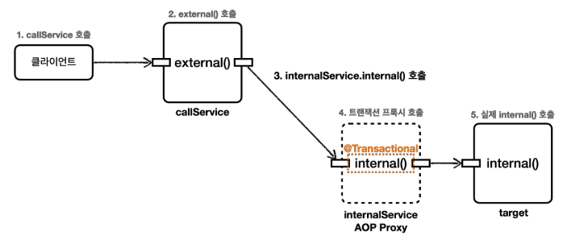

# 트랜잭션 AOP 주의 사항 - 프록시 내부 호출 2
```04.Transaction_AOP_Precautions_1.md```의 내용에 이어, 메서드 내부 호출 때문에 트랜잭션 프록시가 적용되지 않는 문제를 해결하기 위해 ```internal()```메서드를 별도의 클래스로 분리하자.

<br>

### 예제(InternalCallV2Test.java) 확인
* ```InternalService``` 클래스를 만들고 ```internal()``` 메서드를 여기로 옮겼다.
* 이렇게 메서드 내부 호출을 외부 호출로 변경했다.
* ```CallService``` 에는 트랜잭션 관련 코드가 전혀 없으므로 트랜잭션 프록시가 적용되지 않는다.
* ```InternalService``` 에는 트랜잭션 관련 코드가 있으므로 트랜잭션 프록시가 적용된다.



실제 호출되는 흐름을 분석해보자.
1. 클라이언트인 테스트 코드는 ```callService.external()```을 호출한다.
2. ```callService```는 실제 ```callService```객체 인스턴스이다.
3. ```callService```는 주입 받은 ```internalService.internal()```을 호출한다.
4. ```internalService```는 트랜잭션 프록시이다. ```internal()```메서드에 ```@Transactional```이 붙어 있으므로 트랜잭션 프록시는 트랜잭션을 적용한다.
5. 트랜잭션 적용 후 실제 ```internalService``` 객체 인스턴스의 ```internal()```을 호출한다.

<br>

### 실행 로그 - externalCallV2()
```
#external()
..InternalCallV2Test$CallService : call external
..InternalCallV2Test$CallService : tx active=false

#internal()
TransactionInterceptor : Getting transaction for
[..InternalService.internal]
..rnalCallV2Test$InternalService : call internal
..rnalCallV2Test$InternalService : tx active=true
TransactionInterceptor : Completing transaction for
[..InternalService.internal]
```
* ```TransactionInterceptor``` 를 통해 트랜잭션이 적용되는 것을 확인할 수 있다.
* ```InternalService``` 의 ```tx active=true``` 로그를 통해 ```internal()``` 호출에서 트랜잭션이 적용된 것을 확인할 수 있다.

여러가지 다른 해결방안도 있지만, 실무에서는 이렇게 별로의 클래스로 분리하는 방법을 주로 사용한다.

<br>

## public 메서드만 트랜잭션 적용
스프링의 트랜잭션 AOP 기능은 ```public```메서드에만 트랜잭션을 적용하도록 기본 설정이 되어있다.
그래서 ```protected```, ```private```, ```package-visible```에는 트랜잭션이 적용되지 않는다.
생각해보면 ```protected```, ```package-visible```도 외부에서 호출이 가능하다.
따라서 이 부분은 앞서 설명한 프록시의 내부 호출과는 무관하고, 스프링이 막아둔 것이다.

<br>

스프링이 ```public```에만 트랜잭션을 적용하는 이유는 다음과 같다.
```java
@Transactional
public class Hello {
    public method1();
    method2();
    protected method3();
    private method4();
}
```
* 이렇게 클래스 레벨에 트랜잭션을 적용하면 모든 메서드에 트랜잭션이 걸릴 수 있다.
  그러면 트랜잭션을 의도하지 않는 곳 까지 트랜잭션이 과도하게 적용된다.
  트랜잭션은 주로 비즈니스 로직의 시작점에 걸기 때문에 대부분 외부에 열어준 곳을 시작점으로 사용한다.
  이런 이유로 ```public``` 메서드에만 트랜잭션을 적용하도록 설정되어 있다.
* 앞서 실행했던 코드를 ```package-visible```로 변경해보면 적용되지 않는 것을 확인할 수 있다.

참고로 ```public```이 아닌곳에 ```@Transactional```이 붙어 있으면 예외가 발생하지는 않고, 트랜잭션 적용만 무시된다.

> 참고<br>
> 스프링 부트 3.0 부터는 ```protected``` , ```package-visible``` (default 접근제한자)에도 트랜잭션이 적용된다.