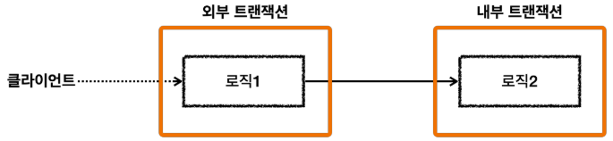
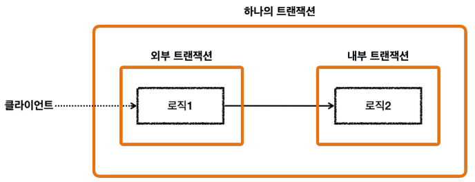
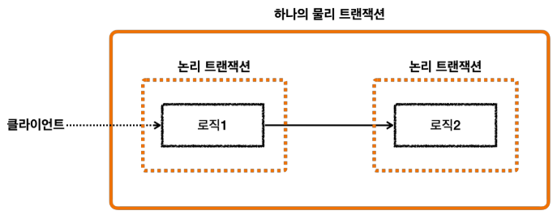
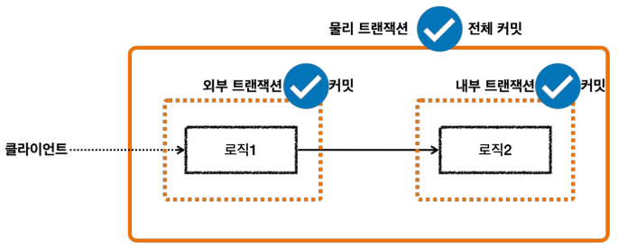
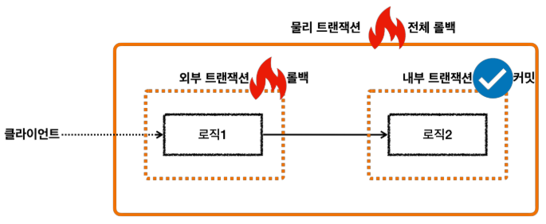
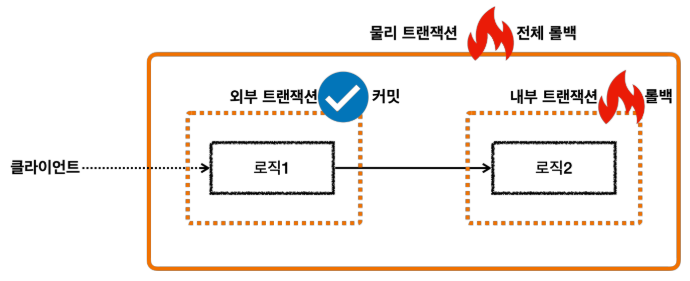

# 스프링 트랜잭션 전파 - 전파 기본
트랜잭션을 각각 사용하는 것이 아니라, 트랜잭션이 이미 진행중인데, 여기에 추가로 트랜잭션을 수행하면 어떻게 될까?<br>
기존 트랜잭션과 별도의 트랜잭션을 진행해야 할까? 아니면 기존 트랜잭션을 그대로 이어 받아서 트랜잭션을 수행해야할까?<br>
이런 경우 어떻게 동작할지 결정하는 것을 트랜잭션 **전파(propagation)**라 한다.<br>
참고로 스프링은 다양한 트랜잭션 전파 옵션을 제공한다.

> 참고<br>
> 해당 내용은 트랜잭션 전파의 기본 옵션인 ```REQUIRED```를 기준으로 설명한다.

<br>

### 외부 트랜잭션이 수행중인데, 내부 트랜잭션이 추가로 수행됨

* 외부 트랜잭션이 수행중이고, 아직 끝나지 않았는데, 내부 트랜잭션이 수행된다.
* 외부 트랜잭션이라고 이름 붙인 것은 둘 중 상대적으로 밖에 있기 때문에 외부 트랜잭션이라 한다. 처음 시작된 트랜잭션으로 이해하면 된다.
* 내부 트랜잭션은 외부에 트랜잭션이 수행되고 있는 도중에 호출되기 때문에 마치 내부에 있는 것 처럼 보여서 내부 트랜잭션이라 한다.


* 스프링에서 이 경우 외부 트랜잭션과 내부 트랜잭션을 묶어서 하나의 트랜잭션을 만들어준다. 내부 트랜잭션이 외부 트랜잭션에 참여하는 것이다.
  이것이 기본 동작이고, 옵션을 통해 다른 동작방식도 선택할 수 있다. (다른 동작 방식은 나중에 알아보자.)

<br>

### 물리 트랜잭션, 논리 트랜잭션

* 스프링은 이해를 돕기 위해 논리 트랜잭션과 물리 트랜잭션이라는 개념을 나눈다.
* 논리 트랜잭션들은 하나의 물리 트랜잭션으로 묶인다.
* 물리 트랜잭션은 우리가 이해하는 실제 데이터베이스에 적용되는 트랜잭션을 뜻한다. 실제 커넥션을 통해서 트랜잭션을 시작( ```setAutoCommit(false)```) 하고, 
  실제 커넥션을 통해서 커밋, 롤백하는 단위이다.
* 논리 트랜잭션은 트랜잭션 매니저를 통해 트랜잭션을 사용하는 단위이다.
* 이러한 논리 트랜잭션 개념은 트랜잭션이 진행되는 중에 내부에 추가로 트랜잭션을 사용하는 경우에 나타난다.
  단순히 트랜잭션이 하나인 경우 둘을 구분하지는 않는다. (더 정확히는 REQUIRED 전파 옵션을 사용하는 경우에 나타나고, 이 옵션은 나중에 설명한다.)

<br>

그럼 왜 이렇게 논리 트랜잭션과 물리 트랜잭션을 나누어 설명하는 것일까?<br>
트랜잭션이 사용중일 때 또 다른 트랜잭션이 내부에 사용되면 여러가지 복잡한 상황이 발생한다. 이때 논리 트랜잭션 개념을 도입하면 다음과 같은 단순한 원칙을 만들 수 있다.

<br>

## 원칙
* ### **모든 논리 트랜잭션이 커밋되어야 물리 트랜잭션이 커밋된다.**
* ### **하나의 논리 트랜잭션이라도 롤백되면 물리 트랜잭션은 롤백된다**
풀어서 설명하면 이렇게 된다. 모든 트랜잭션 매니저를 커밋해야 물리 트랜잭션이 커밋된다. 하나의 트랜잭션 매니저라도 롤백하면 물리 트랜잭션은 롤백된다.

<br>

* ### 모든 논리 트랜잭션이 커밋 되었으므로 물리 트랜잭션도 커밋된다.


<br>


* ### 외부 논리 트랜잭션이 롤백 되었으므로 물리 트랜잭션은 롤백된다


<br>


* ### 내부 논리 트랜잭션이 롤백 되었으므로 물리 트랜잭션은 롤백된다.
