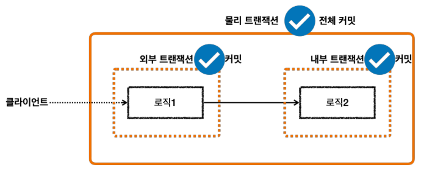
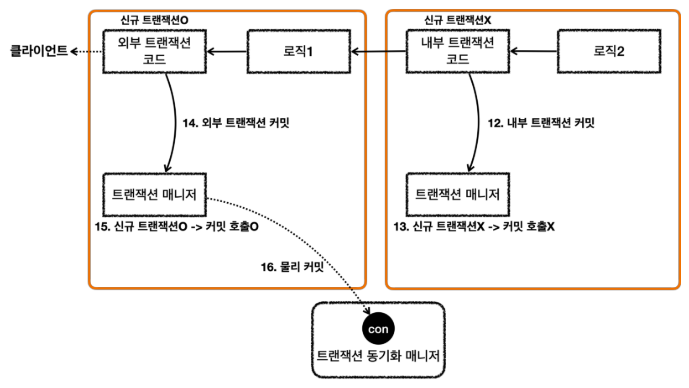

# 스프링 트랜잭션 전파 예제 - 커밋( + BasicTxTest.java)

실행 결과 - inner_commit()
```
외부 트랜잭션 시작
Creating new transaction with name [null]:
PROPAGATION_REQUIRED,ISOLATION_DEFAULT
Acquired Connection [HikariProxyConnection@1943867171 wrapping conn0] for JDBC transaction
Switching JDBC Connection [HikariProxyConnection@1943867171 wrapping conn0] to manual commit
outer.isNewTransaction()=true

내부 트랜잭션 시작
Participating in existing transaction
inner.isNewTransaction()=false
내부 트랜잭션 커밋

외부 트랜잭션 커밋
Initiating transaction commit
Committing JDBC transaction on Connection [HikariProxyConnection@1943867171 wrapping conn0]
Releasing JDBC Connection [HikariProxyConnection@1943867171 wrapping conn0] after transaction
```
* 내부 트랜잭션을 시작할 때 ```Participating in existing transaction``` 이라는 메시지를 확인할 수 있다.
  이 메시지는 내부 트랜잭션이 기존에 존재하는 외부 트랜잭션에 참여한다는 뜻이다.
* 실행 결과를 보면 외부 트랜잭션을 시작하거나 커밋할 때는 DB 커넥션을 통한 물리 트랜잭션을 시작( ```manual commit``` )하고, DB 커넥션을 통해 커밋 하는 것을 확인할 수 있다.
  그런데 내부 트랜잭션을 시작하거나 커밋할 때는 DB 커넥션을 통해 커밋하는 로그를 전혀 확인할 수 없다.
* 정리하면 외부 트랜잭션만 물리 트랜잭션을 시작하고, 커밋한다.
* 만약 내부 트랜잭션이 실제 물리 트랜잭션을 커밋하면 트랜잭션이 끝나버리기 때문에, 트랜잭션을 처음 시작한 외부 트랜잭션까지 이어갈 수 없다.
  따라서 내부 트랜잭션은 DB 커넥션을 통한 물리 트랜잭션을 커밋하면 안된다.
* 스프링은 이렇게 여러 트랜잭션이 함께 사용되는 경우, **처음 트랜잭션을 시작한 외부 트랜잭션이 실제 물리 트랜잭션을 관리**하도록 한다.
  이를 통해 트랜잭션 중복 커밋 문제를 해결한다.



---
<br>

트랜잭션 전파가 실제 어떻게 동작하는지 그림으로 알아보자.


## 요청 흐름 - 외부 트랜잭션

1. ```txManager.getTransaction()``` 를 호출해서 외부 트랜잭션을 시작한다.
2. 트랜잭션 매니저는 데이터소스를 통해 커넥션을 생성한다.
3. 생성한 커넥션을 수동 커밋 모드( ```setAutoCommit(false)``` )로 설정한다. - **물리 트랜잭션 시작**
4. 트랜잭션 매니저는 트랜잭션 동기화 매니저에 커넥션을 보관한다.
5. 트랜잭션 매니저는 트랜잭션을 생성한 결과를 ```TransactionStatus``` 에 담아서 반환하는데, 여기에 신규 트랜잭션의 여부가 담겨 있다.
   ```isNewTransaction``` 를 통해 신규 트랜잭션 여부를 확인할 수 있다. 트랜잭션을 처음 시작했으므로 신규 트랜잭션이다.( ```true``` )
6. 로직1이 사용되고, 커넥션이 필요한 경우 트랜잭션 동기화 매니저를 통해 트랜잭션이 적용된 커넥션을 획득해서 사용한다.

<br>

## 요청 흐름 - 내부 트랜잭션
7. ```txManager.getTransaction()``` 를 호출해서 내부 트랜잭션을 시작한다.
8. 트랜잭션 매니저는 트랜잭션 동기화 매니저를 통해서 기존 트랜잭션이 존재하는지 확인한다.
9. 기존 트랜잭션이 존재하므로 기존 트랜잭션에 참여한다. 기존 트랜잭션에 참여한다는 뜻은 사실 아무것도 하지 않는다는 뜻이다.
   * 이미 기존 트랜잭션인 외부 트랜잭션에서 물리 트랜잭션을 시작했다. 그리고 물리 트랜잭션이 시작된 커넥션을 트랜잭션 동기화 매니저에 담아두었다.
   * 따라서 이미 물리 트랜잭션이 진행중이므로 그냥 두면 이후 로직이 기존에 시작된 트랜잭션을 자연스럽게 사용하게 되는 것이다.
   * 이후 로직은 자연스럽게 트랜잭션 동기화 매니저에 보관된 기존 커넥션을 사용하게 된다.
10. 트랜잭션 매니저는 트랜잭션을 생성한 결과를 ```TransactionStatus``` 에 담아서 반환하는데, 여기에서
    ```isNewTransaction``` 를 통해 신규 트랜잭션 여부를 확인할 수 있다. 여기서는 기존 트랜잭션에 참여했기 때문에 신규 트랜잭션이 아니다. ( ```false``` )
11. 로직2가 사용되고, 커넥션이 필요한 경우 트랜잭션 동기화 매니저를 통해 외부 트랜잭션이 보관한 커넥션을 획득해서 사용한다.

---
<br><br>



## 응답 흐름 - 내부 트랜잭션
12. 로직2가 끝나고 트랜잭션 매니저를 통해 내부 트랜잭션을 커밋한다.
13. 트랜잭션 매니저는 커밋 시점에 신규 트랜잭션 여부에 따라 다르게 동작한다. 이 경우 신규 트랜잭션이 아니기 때문에 실제 커밋을 호출하지 않는다.
    이 부분이 중요한데, 실제 커넥션에 커밋이나 롤백을 호출하면 물리 트랜잭션이 끝나버린다. 아직 트랜잭션이 끝난 것이 아니기 때문에 실제 커밋을 호출하면 안된다.
    물리 트랜잭션은 외부 트랜잭션을 종료할 때 까지 이어져야한다.

<br>

## 응답 흐름 - 외부 트랜잭션
14. 로직1이 끝나고 트랜잭션 매니저를 통해 외부 트랜잭션을 커밋한다.
15. 트랜잭션 매니저는 커밋 시점에 신규 트랜잭션 여부에 따라 다르게 동작한다. 외부 트랜잭션은 신규 트랜잭션이다. 따라서 DB 커넥션에 실제 커밋을 호출한다.
16. 트랜잭션 매니저에 커밋하는 것이 논리적인 커밋이라면, 실제 커넥션에 커밋하는 것을 물리 커밋이라 할 수 있다. 실제 데이터베이스에 커밋이 반영되고, 물리 트랜잭션도 끝난다.

<br>

## 핵심 정리
* 여기서 핵심은 트랜잭션 매니저에 커밋을 호출한다고해서 항상 실제 커넥션에 물리 커밋이 발생하지는 않는다는 점이다.
* 신규 트랜잭션인 경우에만 실제 커넥션을 사용해서 물리 커밋과 롤백을 수행한다. 신규 트랜잭션이 아니면 실제 물리 커넥션을 사용하지 않는다.
* 이렇게 트랜잭션이 내부에서 추가로 사용되면 트랜잭션 매니저에 커밋하는 것이 항상 물리 커밋으로 이어지지 않는다.
  그래서 이 경우 논리 트랜잭션과 물리 트랜잭션을 나누게 된다. 또는 외부 트랜잭션과 내부 트랜잭션으로 나누어 설명하기도 한다.
* 트랜잭션이 내부에서 추가로 사용되면, 트랜잭션 매니저를 통해 논리 트랜잭션을 관리하고, 모든 논리 트랜잭션이 커밋되면 물리 트랜잭션이 커밋된다고 이해하면 된다.