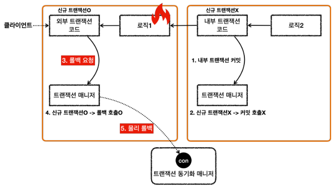

# 스프링 트랜잭션 전파 예제 - 외부 트랜잭션 롤백( + BasicTxTest.java)

실행 결과 - outer_rollback()
```
외부 트랜잭션 시작
Creating new transaction with name [null]:
PROPAGATION_REQUIRED,ISOLATION_DEFAULT
Acquired Connection [HikariProxyConnection@461376017 wrapping conn0] for JDBC transaction
Switching JDBC Connection [HikariProxyConnection@461376017 wrapping conn0] to manual commit

내부 트랜잭션 시작
Participating in existing transaction
내부 트랜잭션 커밋

외부 트랜잭션 롤백
Initiating transaction rollback
Rolling back JDBC transaction on Connection [HikariProxyConnection@461376017 wrapping conn0]
Releasing JDBC Connection [HikariProxyConnection@461376017 wrapping conn0] after transaction
```
* 외부 트랜잭션이 물리 트랜잭션을 시작하고 롤백하는 것을 확인할 수 있다.
* 내부 트랜잭션은 앞서 배운대로 직접 물리 트랜잭션에 관여하지 않는다.
* 결과적으로 외부 트랜잭션에서 시작한 물리 트랜잭션의 범위가 내부 트랜잭션까지 사용된다. 이후 외부 트랜잭션이 롤백되면서 전체 내용은 모두 롤백된다.

<br>

### 응답 흐름



## 응답 흐름 - 내부 트랜잭션
1. 로직2가 끝나고 트랜잭션 매니저를 통해 내부 트랜잭션을 커밋한다.
2. 트랜잭션 매니저는 커밋 시점에 신규 트랜잭션 여부에 따라 다르게 동작한다. 이 경우 신규 트랜잭션이 아니기 때문에 실제 커밋을 호출하지 않는다.
   이 부분이 중요한데, 실제 커넥션에 커밋이나 롤백을 호출하면 물리 트랜잭션이 끝나버린다. 아직 트랜잭션이 끝난 것이 아니기 때문에 실제 커밋을 호출하면 안된다.
   물리 트랜잭션은 외부 트랜잭션을 종료할 때 까지 이어져야한다.

<br>

## 응답 흐름 - 외부 트랜잭션
3. 로직1이 끝나고 트랜잭션 매니저를 통해 외부 트랜잭션을 롤백한다.
4. 트랜잭션 매니저는 롤백 시점에 신규 트랜잭션 여부에 따라 다르게 동작한다. 외부 트랜잭션은 신규 트랜잭션이다. 따라서 DB 커넥션에 실제 롤백을 호출한다.
5. 트랜잭션 매니저에 롤백하는 것이 논리적인 롤백이라면, 실제 커넥션에 롤백하는 것을 물리 롤백이라 할 수 있다.
   실제 데이터베이스에 롤백이 반영되고, 물리 트랜잭션도 끝난다.