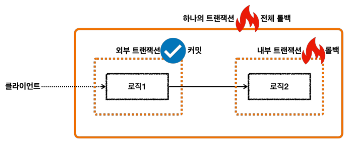
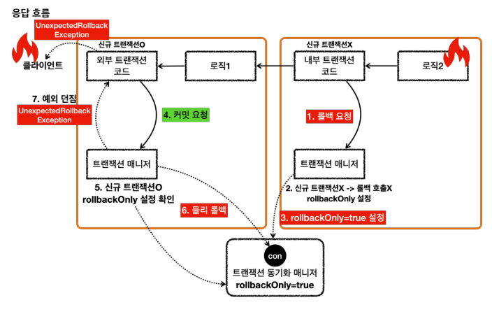

# 스프링 트랜잭션 전파 예제 - 내부 트랜잭션 롤백( + BasicTxTest.java)

실행 결과 - inner_rollback()
```
외부 트랜잭션 시작
Creating new transaction with name [null]:
PROPAGATION_REQUIRED,ISOLATION_DEFAULT
Acquired Connection [HikariProxyConnection@220038608 wrapping conn0] for JDBC transaction
Switching JDBC Connection [HikariProxyConnection@220038608 wrapping conn0] to manual commit

내부 트랜잭션 시작
Participating in existing transaction
내부 트랜잭션 롤백
Participating transaction failed - marking existing transaction as rollback-only
Setting JDBC transaction [HikariProxyConnection@220038608 wrapping conn0] rollback-only

외부 트랜잭션 커밋
Global transaction is marked as rollback-only but transactional code requested commit
Initiating transaction rollback
Rolling back JDBC transaction on Connection [HikariProxyConnection@220038608 wrapping conn0]
Releasing JDBC Connection [HikariProxyConnection@220038608 wrapping conn0] after transaction
```
* 외부 트랜잭션 시작
  * 물리 트랜잭션을 시작한다.
* 내부 트랜잭션 시작
  * ```Participating in existing transaction```
  * 기존 트랜잭션에 참여한다.
* 내부 트랜잭션 롤백
  * ```Participating transaction failed - marking existing transaction as rollback-only``` 
  * 내부 트랜잭션을 롤백하면 실제 물리 트랜잭션은 롤백하지 않는다. 대신에 기존 트랜잭션을 롤백 전용으로 표시한다. 
* 외부 트랜잭션 커밋 
  * 외부 트랜잭션을 커밋한다. 
  * ```Global transaction is marked as rollback-only``` 
  * 커밋을 호출했지만, 전체 트랜잭션이 롤백 전용으로 표시되어 있다. 따라서 물리 트랜잭션을 롤백한다.

<br>




## 응답 흐름 - 내부 트랜잭션
1. 로직2가 끝나고 트랜잭션 매니저를 통해 내부 트랜잭션을 롤백한다. (로직2에 문제가 있어서 롤백한다고 가정한다.)
2. 트랜잭션 매니저는 롤백 시점에 신규 트랜잭션 여부에 따라 다르게 동작한다. 이 경우 신규 트랜잭션이 아니기 때문에 실제 롤백을 호출하지 않는다.
   이 부분이 중요한데, 실제 커넥션에 커밋이나 롤백을 호출하면 물리 트랜잭션이 끝나버린다. 아직 트랜잭션이 끝난 것이 아니기 때문에 실제 롤백을 호출하면 안된다.
   물리 트랜잭션은 외부 트랜잭션을 종료할 때 까지 이어져야한다.
3. 내부 트랜잭션은 물리 트랜잭션을 롤백하지 않는 대신에 트랜잭션 동기화 매니저에 ```rollbackOnly=true``` 라는 표시를 해둔다.

<br>

## 응답 흐름 - 외부 트랜잭션
4. 로직1이 끝나고 트랜잭션 매니저를 통해 외부 트랜잭션을 커밋한다.
5. 트랜잭션 매니저는 커밋 시점에 신규 트랜잭션 여부에 따라 다르게 동작한다. 외부 트랜잭션은 신규 트랜잭션이다.
   따라서 DB 커넥션에 실제 커밋을 호출해야 한다. 이때 먼저 트랜잭션 동기화 매니저에 롤백 전용( ```rollbackOnly=true``` ) 표시가 있는지 확인한다.
   롤백 전용 표시가 있으면 물리 트랜잭션을 커밋하는 것이 아니라 롤백한다.
6. 실제 데이터베이스에 롤백이 반영되고, 물리 트랜잭션도 끝난다.
7. 트랜잭션 매니저에 커밋을 호출한 개발자 입장에서는 분명 커밋을 기대했는데 롤백 전용 표시로 인해 실제로는 롤백이 되어버렸다.
   * 이것은 조용히 넘어갈 수 있는 문제가 아니다. 시스템 입장에서는 커밋을 호출했지만 롤백이 되었다는 것은 분명하게 알려주어야 한다.
   * 예를 들어서 고객은 주문이 성공했다고 생각했는데, 실제로는 롤백이 되어서 주문이 생성되지 않은 것이다.
   * 스프링은 이 경우 ```UnexpectedRollbackException``` 런타임 예외를 던진다. 그래서 커밋을 시도했지만, 기대하지 않은 롤백이 발생했다는 것을 명확하게 알려준다.

<br>

## 정리
* 논리 트랜잭션이 하나라도 롤백되면 물리 트랜잭션은 롤백된다.
* 내부 논리 트랜잭션이 롤백되면 롤백 전용 마크를 표시한다.
* 외부 트랜잭션을 커밋할 때 롤백 전용 마크를 확인한다. 롤백 전용 마크가 표시되어 있으면 물리 트랜잭션을 롤백하고, ```UnexpectedRollbackException``` 예외를 던진다.

> 참고<br>
> 애플리케이션 개발에서 중요한 기본 원칙은 모호함을 제거하는 것이다. 개발은 명확해야 한다.
> 이렇게 커밋을 호출했는데, 내부에서 롤백이 발생한 경우 모호하게 두면 아주 심각한 문제가 발생한다.
> 이렇게 기대한 결과가 다른경우 예외를 발생시켜서 명확하게 문제를 알려주는 것이 좋은 설계이다.
