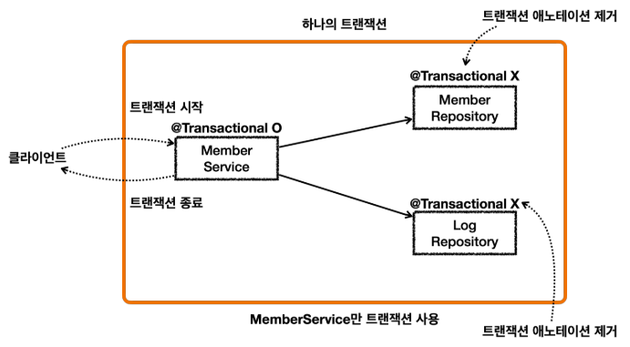
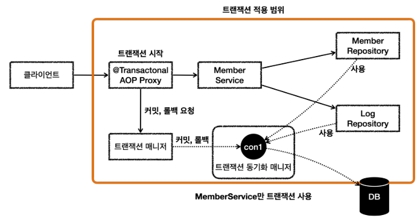
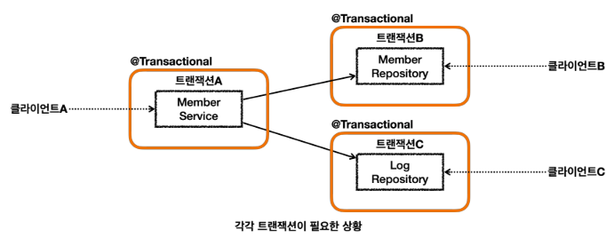
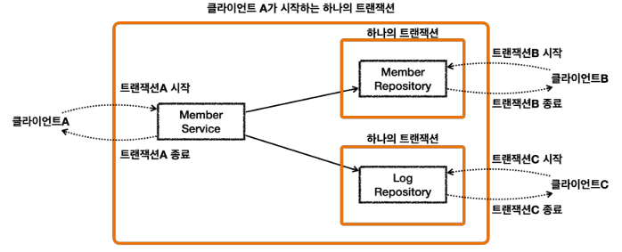
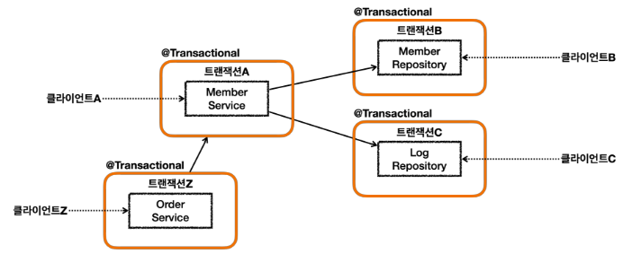

# 트랜잭션 전파 활용 - 단일 트랜잭션

<br>


* 이렇게 하면 ```MemberService``` 를 시작할 때 부터 종료할 때 까지의 모든 로직을 하나의 트랜잭션으로 묶을 수 있다.
  * 물론 ```MemberService``` 가 ```MemberRepository``` , ```LogRepository``` 를 호출하므로 이 로직들은 같은 트랜잭션을 사용한다.
* ```MemberService``` 만 트랜잭션을 처리하기 때문에 앞서 배운 논리 트랜잭션, 물리 트랜잭션, 외부 트랜잭션, 내부 트랜잭션, ```rollbackOnly```, 
  신규 트랜잭션, 트랜잭션 전파와 같은 복잡한 것을 고민할 필요가 없다. 아주 단순하고 깔끔하게 트랜잭션을 묶을 수 있다.

<br>


* ```@Transactional``` 이 ```MemberService``` 에만 붙어있기 때문에 여기에만 트랜잭션 AOP가 적용된다.
  * ```MemberRepository``` , ```LogRepository``` 는 트랜잭션 AOP가 적용되지 않는다.
* ```MemberService``` 의 시작부터 끝까지, 관련 로직은 해당 트랜잭션이 생성한 커넥션을 사용하게 된다.
  * ```MemberService``` 가 호출하는 ```MemberRepository``` , ```LogRepository``` 도 같은 커넥션을 사용하면서 자연스럽게 트랜잭션 범위에 포함된다.

<br>

### 참고
같은 쓰레드를 사용하면 트랜잭션 동기화 매니저는 같은 커넥션을 반환한다.

**"직접 실행해서 로그와 그림을 비교해보자"**

<br>

## 각각 트랜잭션이 필요한 상황
하지만 다음과 같이 각각 트랜잭션이 필요하면 어떻게 해야할까?


<br>

### 트랜잭션 적용 범위

* 클라이언트 A는 ```MemberService``` 부터 ```MemberRepository``` , ```LogRepository``` 를 모두 하나의 트랜잭션으로 묶고 싶다.
* 클라이언트 B는 ```MemberRepository``` 만 호출하고 여기에만 트랜잭션을 사용하고 싶다.
* 클라이언트 C는 ```LogRepository``` 만 호출하고 여기에만 트랜잭션을 사용하고 싶다.
* 클라이언트 A만 생각하면 ```MemberService``` 에 트랜잭션 코드를 남기고, ```MemberRepository```, ```LogRepository``` 의 트랜잭션 코드를 제거하면 앞서 배운 것 처럼 깔끔하게 하나의 트랜잭션을 적용할 수 있다.<br>
  하지만 이렇게 되면 클라이언트 B, C가 호출하는 ```MemberRepository``` , ```LogRepository``` 에는 트랜잭션을 적용할 수 없다.

<br>

트랜잭션 전파 없이 이런 문제를 해결하려면 아마도 트랜잭션이 있는 메서드와 트랜잭션이 없는 메서드를 각각 만들어야 할 것이다.

더 복잡하게 다음과 같은 상황이 발생할 수도 있다.

<br>



클라이언트 Z가 호출하는 ```OrderService``` 에서도 트랜잭션을 시작할 수 있어야 하고, 클라이언트A가 호출하는 ```MemberService``` 에서도 트랜잭션을 시작할 수 있어야 한다.

**"이런 문제를 해결하기 위해 트랜잭션 전파가 필요한 것이다."**