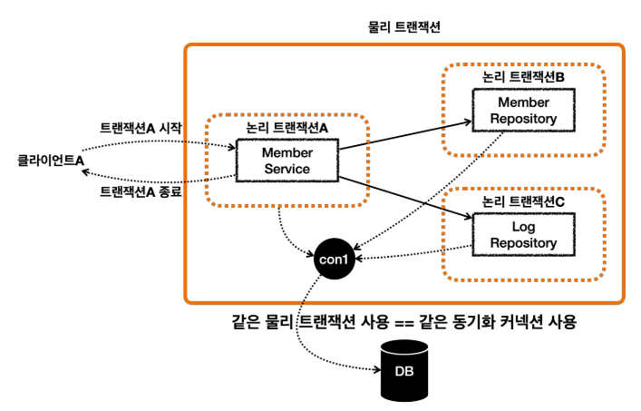
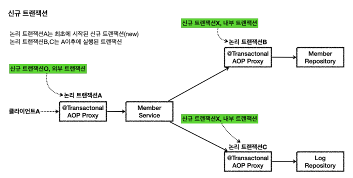
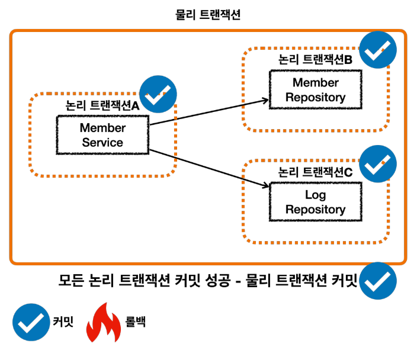
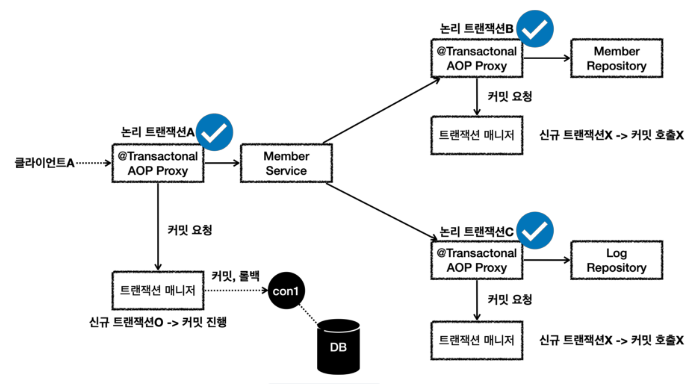

# 트랜잭션 전파 활용 - 전파 커밋
스프링은 ```@Transactional```이 적용되어 있으면 기본으로 ```REQUIRED```라는 전파 옵션을 사용한다.<br>
이 옵션은 기존 트랜잭션이 없으면 트랜잭션을 생성하고, 기존 트랜잭션이 있으면 기존 트랜잭션에 참여한다.<br>
참여한다는 뜻은 해당 트랜잭션을 그대로 따른다는 뜻이고, 동시에 같은 동기화 커넥션을 사용한다는 뜻이다.

<br>



이렇게 둘 이상의 트랜잭션이 하나의 물리 트랜잭션에 묶이게 되면 둘을 구분하기 위해 논리 트랜잭션과 물리 트랜잭션으로 구분한다.

<br>


* 이 경우 외부에 있는 신규 트랜잭션만 실제 물리 트랜잭션을 시작하고 커밋한다.
* 내부에 있는 트랜잭션은 물리 트랜잭션 시작하거나 커밋하지 않는다.

<br>

### 모든 논리 트랜잭션 커밋

* 모든 논리 트랜잭션을 커밋해야 물리 트랜잭션도 커밋된다. 하나라도 롤백되면 물리 트랜잭션은 롤백된다.

<br>


* 클라이언트A(여기서는 테스트 코드)가 ```MemberService``` 를 호출하면서 트랜잭션 AOP가 호출된다.
  * 여기서 신규 트랜잭션이 생성되고, 물리 트랜잭션도 시작한다.
* ```MemberRepository``` 를 호출하면서 트랜잭션 AOP가 호출된다.
  * 이미 트랜잭션이 있으므로 기존 트랜잭션에 참여한다.
* ```MemberRepository``` 의 로직 호출이 끝나고 정상 응답하면 트랜잭션 AOP가 호출된다.
  * 트랜잭션 AOP는 정상 응답이므로 트랜잭션 매니저에 커밋을 요청한다. 이 경우 신규 트랜잭션이 아니므로 실제 커밋을 호출하지 않는다.
* ```LogRepository``` 를 호출하면서 트랜잭션 AOP가 호출된다.
  * 이미 트랜잭션이 있으므로 기존 트랜잭션에 참여한다.
* ```LogRepository``` 의 로직 호출이 끝나고 정상 응답하면 트랜잭션 AOP가 호출된다.
  * 트랜잭션 AOP는 정상 응답이므로 트랜잭션 매니저에 커밋을 요청한다. 이 경우 신규 트랜잭션이 아니므로 실제 커밋(물리 커밋)을 호출하지 않는다.
* ```MemberService``` 의 로직 호출이 끝나고 정상 응답하면 트랜잭션 AOP가 호출된다.
  * 트랜잭션 AOP는 정상 응답이므로 트랜잭션 매니저에 커밋을 요청한다. 이 경우 신규 트랜잭션이므로 물리 커밋을 호출한다.