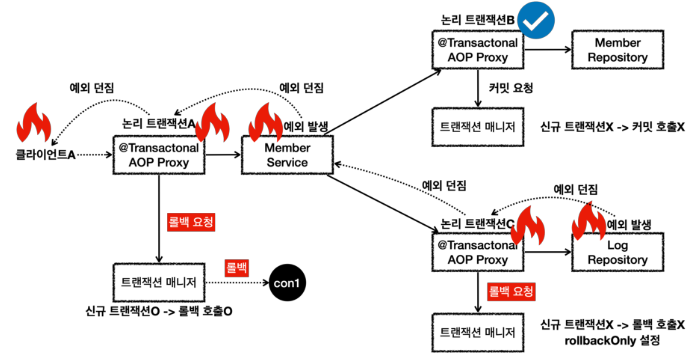

# 트랜잭션 전파 활용 - 전파 롤백


<br>

## 흐름


* 클라이언트A가 ```MemberService``` 를 호출하면서 트랜잭션 AOP가 호출된다.
  * 여기서 신규 트랜잭션이 생성되고, 물리 트랜잭션도 시작한다.
* ```MemberRepository``` 를 호출하면서 트랜잭션 AOP가 호출된다.
  * 이미 트랜잭션이 있으므로 기존 트랜잭션에 참여한다.
* ```MemberRepository``` 의 로직 호출이 끝나고 정상 응답하면 트랜잭션 AOP가 호출된다.
  * 트랜잭션 AOP는 정상 응답이므로 트랜잭션 매니저에 커밋을 요청한다. 이 경우 신규 트랜잭션이 아니므로 실제 커밋을 호출하지 않는다.
* ```LogRepository``` 를 호출하면서 트랜잭션 AOP가 호출된다.
  * 이미 트랜잭션이 있으므로 기존 트랜잭션에 참여한다.
* ```LogRepository``` 로직에서 런타임 예외가 발생한다. 예외를 던지면 트랜잭션 AOP가 해당 예외를 받게 된다.
  * 트랜잭션 AOP는 런타임 예외가 발생했으므로 트랜잭션 매니저에 롤백을 요청한다. 이 경우 신규 트랜잭션이 아니므로 물리 롤백을 호출하지는 않는다. 대신에 ```rollbackOnly```를 설정한다.
  * ```LogRepository``` 가 예외를 던졌기 때문에 트랜잭션 AOP도 해당 예외를 그대로 밖으로 던진다.
* ```MemberService``` 에서도 런타임 예외를 받게 되는데, 여기 로직에서는 해당 런타임 예외를 처리하지 않고 밖으로 던진다.
  * 트랜잭션 AOP는 런타임 예외가 발생했으므로 트랜잭션 매니저에 롤백을 요청한다. 이 경우 신규 트랜잭션이므로 물리 롤백을 호출한다.
  * 참고로 이 경우 어차피 롤백이 되었기 때문에, ```rollbackOnly``` 설정은 참고하지 않는다.
  * ```MemberService``` 가 예외를 던졌기 때문에 트랜잭션 AOP도 해당 예외를 그대로 밖으로 던진다.
* 클라이언트A는 ```LogRepository``` 부터 넘어온 런타임 예외를 받게 된다.

<br>

## 정리
회원과 회원 이력 로그를 처리하는 부분을 하나의 트랜잭션으로 묶은 덕분에 문제가 발생했을 때 회원과 회원 이력 로그가 모두 함께 롤백된다.<br>
따라서 데이터 정합성에 문제가 발생하지 않는다.