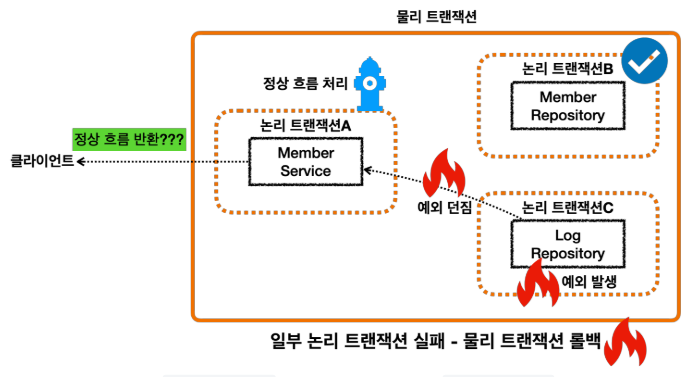
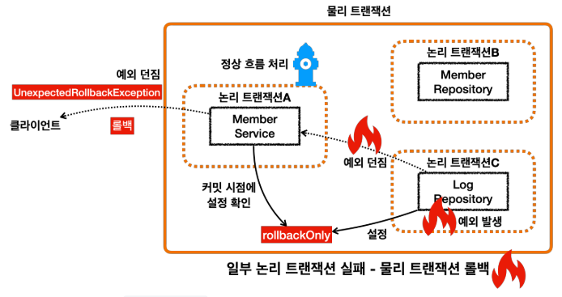
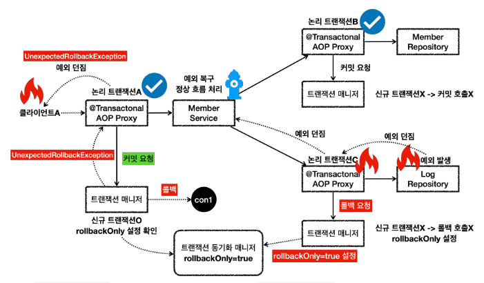

# 트랜잭션 전파 활용 - 복구 REQUIRED
앞서 회원과 로그를 하나의 트랜잭션으로 묶어서 데이터 정합성 문제를 깔끔하게 해결했다.
그런데 회원 이력 로그를 DB에 남기는 작업에 가끔 문제가 발생해서 회원 가입 자체가 안되는 경우가 가끔 발생하게 되었다.
그래서 사용자들이 회원 가입에 실패해서 이탈하는 문제가 발생하기 시작했다.<br>
회원 이력 로그의 경우 여러가지 방법으로 추후에 복구가 가능할 것으로 보인다.<br>
그래서 비즈니스 요구사항이 변경되었다.<br>
**회원 가입을 시도한 로그를 남기는데 실패하더라도 회원 가입은 유지되어야 한다.**

<br>


* 단순하게 생각해보면 ```LogRepository``` 에서 예외가 발생하면 그것을 ```MemberService``` 에서 예외를 잡아서 처리하면 될 것 같다.
* 이렇게 하면 ```MemberService``` 에서 정상 흐름으로 바꿀 수 있기 때문에 ```MemberService``` 의 트랜잭션 AOP에서 커밋을 수행할 수 있다.
* 맞다. 뭔가 이상하게 느껴질 것이다. 이 방법이 실패할 것으로 생각했다면, 지금까지 제대로 학습한 것이다.

이 방법이 왜 실패하는지 예제를 통해서 알아보자. 참고로 실무에서 많은 개발자가 이 방법을 사용해서 실패한다.

<br>

### 프로젝트 예제를 살펴보면 ```memberService.joinV2()```를 호출하는 부분을 주의해야 한다. ```joinV2()```에는 예외를 잡아서 정상 흐름으로 변환하는 로직이 추가되어 있다.

<br>



* 내부 트랜잭션에서 ```rollbackOnly``` 를 설정하기 때문에 결과적으로 정상 흐름 처리를 해서 외부 트랜잭션에서 커밋을 호출해도 물리 트랜잭션은 롤백된다.
* 그리고 ```UnexpectedRollbackException``` 이 던져진다.

### 전체 흐름을 좀 더 자세히 알아보자.

<br>


* ```LogRepository``` 에서 예외가 발생한다. 예외를 던지면 ```LogRepository``` 의 트랜잭션 AOP가 해당 예외를 받는다.
* 신규 트랜잭션이 아니므로 물리 트랜잭션을 롤백하지는 않고, 트랜잭션 동기화 매니저에 ```rollbackOnly```를 표시한다.
* 이후 트랜잭션 AOP는 전달 받은 예외를 밖으로 던진다.
* 예외가 ```MemberService```에 던져지고, ```MemberService```는 해당 예외를 복구한다. 그리고 정상적으로 리턴한다.
* 정상 흐름이 되었으므로 ```MemberService```의 트랜잭션 AOP는 커밋을 호출한다.
* 커밋을 호출할 때 신규 트랜잭션이므로 실제 물리 트랜잭션을 커밋해야 한다. 이때 ```rollbackOnly```를 체크한다.
* ```rollbackOnly``` 가 체크 되어 있으므로 물리 트랜잭션을 롤백한다.
* 트랜잭션 매니저는 ```UnexpectedRollbackException``` 예외를 던진다.
* 트랜잭션 AOP도 전달받은 ```UnexpectedRollbackException``` 을 클라이언트에 던진다.

<br>

### 정리
* 논리 트랜잭션 중 하나라도 롤백되면 전체 트랜잭션은 롤백된다.
* 내부 트랜잭션이 롤백 되었는데, 외부 트랜잭션이 커밋되면 ```UnexpectedRollbackException``` 예외가 발생한다.
* ```rollbackOnly``` 상황에서 커밋이 발생하면 ```UnexpectedRollbackException``` 예외가 발생한다.

그렇다면 어떻게 해야 다음 요구사항을 만족할 수 있을까?
**회원 가입을 시도한 로그를 남기는데 실패하더라도 회원 가입은 유지되어야 한다.**